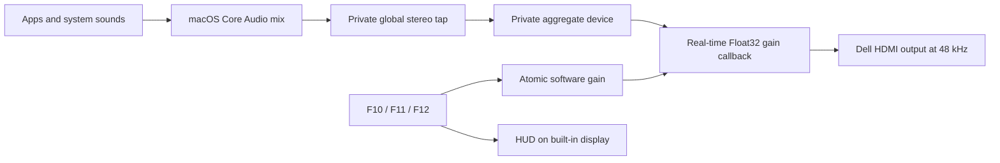

# VoluMAC

VoluMAC is a lightweight native menu-bar utility that routes macOS audio to a Dell HDMI/DisplayPort monitor and provides software volume control when the display exposes no writable Core Audio volume control. The current app bundle and menu-bar product are named **Dell Audio**.

It is designed for **Dell monitors with integrated speakers connected to an Apple-silicon Mac**, while the Core Audio processing design can be generalized to other external PCM audio devices.

> [!IMPORTANT]
> The current device selection targets output names containing `DELL`. Review `Product.displayMatch` in `DellAudioMenu.swift` before using it with a non-Dell monitor.

## Features

- Selects the Dell for both application audio and system sounds.
- Keeps the Dell at 48 kHz when selected.
- Provides software volume attenuation from 0–100% without a virtual HAL driver.
- Handles global media keys:
  - **F10** — mute/unmute
  - **F11** — volume down
  - **F12** — volume up
  - **Option + Shift + F11/F12** — fine adjustment
- Shows a macOS-style volume HUD on the built-in MacBook display.
- Starts automatically at login through a user LaunchAgent.
- Rebuilds its processing engine if Core Audio restarts or the callback stalls.
- Offers an immediate MacBook-speaker fallback from the menu.
- Does not require eqMac, Background Music, BetterDisplay, a privileged helper, or a third-party audio driver.

## How it works



The app keeps the physical Dell as the visible default output. A private `CATapDescription` captures the outgoing PCM mix and uses `.mutedWhenTapped`, so the original unscaled signal is muted only while the app is actively reading the tap. The Dell and tap share a private aggregate-device clock, and a small Objective-C++ real-time callback applies gain directly to the output buffers.

The callback does not allocate memory, log, acquire locks, or invoke UI code. Swift/AppKit owns the menu and control state; the real-time gain is stored atomically.

### Why software volume?

Some Dell monitor HDMI audio devices expose playback but no writable Core Audio volume or mute property. On the tested DP-to-HDMI path, direct DDC/CI commands also fail. Software attenuation is therefore applied before samples reach the monitor.

Software volume can only attenuate. Set the monitor’s physical OSD volume to a comfortable upper limit; Dell Audio cannot amplify beyond that hardware level.

## Requirements

- Apple-silicon Mac (`arm64` build target)
- macOS 14.2 or newer (Core Audio process taps)
- Xcode Command Line Tools with Swift and Clang
- A stereo PCM output capable of 48 kHz
- Tested on:
  - M1 MacBook Air
  - macOS 26.4
  - Dell monitor with integrated speakers
  - 2-channel HDMI audio at 48 kHz

Install Command Line Tools if needed:

```sh
xcode-select --install
```

## Build

From the repository root:

```sh
./DellAudioMenu/build.sh
```

The ad-hoc-signed app is produced at:

```text
DellAudioMenu/build/Dell Audio.app
```

Run the build directly for development:

```sh
open "DellAudioMenu/build/Dell Audio.app"
```

## Install

The supplied LaunchAgent is a template containing `__HOME__`. The following installation commands substitute the current user’s home directory:

```sh
mkdir -p "$HOME/Applications"
mkdir -p "$HOME/Library/LaunchAgents"
rm -rf "$HOME/Applications/Dell Audio.app"
ditto "DellAudioMenu/build/Dell Audio.app" "$HOME/Applications/Dell Audio.app"
sed "s#__HOME__#$HOME#g" "DellAudioMenu/local.dellaudio.menu.plist" > "$HOME/Library/LaunchAgents/local.dellaudio.menu.plist"
plutil -lint "$HOME/Library/LaunchAgents/local.dellaudio.menu.plist"
launchctl bootout "gui/$(id -u)/local.dellaudio.menu" 2>/dev/null || true
launchctl bootstrap "gui/$(id -u)" "$HOME/Library/LaunchAgents/local.dellaudio.menu.plist"
launchctl kickstart -k "gui/$(id -u)/local.dellaudio.menu"
```

Manual launch:

```sh
open "$HOME/Applications/Dell Audio.app"
```

## Permissions

Dell Audio requests two macOS privacy permissions. Processing remains local on the Mac.

### Screen & System Audio Recording

Required by the public Core Audio tap API. The app does not save, upload, or transmit captured audio; it only scales samples and immediately writes them to the selected output.

Enable Dell Audio in:

**System Settings → Privacy & Security → Screen & System Audio Recording**

### Input Monitoring

Required for global F10/F11/F12 handling. The event tap is listen-only and processes only mute/volume media events and the F10–F12 fallback keycodes.

Enable Dell Audio in:

**System Settings → Privacy & Security → Input Monitoring**

Because local builds are ad-hoc signed, replacing the executable changes its code hash. If media keys stop working after rebuilding, reset only this app’s Input Monitoring decision, restart it, and grant access again:

```sh
tccutil reset ListenEvent local.dellaudio.menu
```

## Usage

1. Connect and power on the Dell display.
2. Start Dell Audio or log in with the LaunchAgent installed.
3. Click the speaker/display icon in the menu bar.
4. Select **Use Dell for All Audio** if it is not already selected.
5. Use the slider, mute button, or F10/F11/F12.

Normal volume steps are `1/16` (6.25%). Option+Shift uses `1/64` (1.5625%) steps.

The HUD is deliberately placed on the active built-in MacBook display using `CGDisplayIsBuiltin`, even when the Dell is the main display. If no built-in display is active (for example, clamshell mode), it falls back to the current main screen.

## Tests

Stop the login instance before running executable tests so only one tap owns the output:

```sh
launchctl bootout "gui/$(id -u)/local.dellaudio.menu" 2>/dev/null || true
pkill -x DellAudioMenu 2>/dev/null || true
```

Set a test app variable:

```sh
APP="$PWD/DellAudioMenu/build/Dell Audio.app"
```

Test media-key decoding without requesting Input Monitoring:

```sh
"$APP/Contents/MacOS/DellAudioMenu" --test-media-key-decode
```

Measure real audio attenuation. This plays a short built-in sound and compares input/output peaks:

```sh
"$APP/Contents/MacOS/DellAudioMenu" --self-test-gain=0.25
```

Expected measured gain is approximately `0.250`.

Test the built-in-speaker fallback. This intentionally leaves both output selectors on the MacBook speakers:

```sh
"$APP/Contents/MacOS/DellAudioMenu" --test-built-in-route
```

Show the HUD on the built-in display for three seconds:

```sh
"$APP/Contents/MacOS/DellAudioMenu" --test-hud
```

Validate the package:

```sh
codesign --verify --deep --strict --verbose=2 "$APP"
plutil -lint "$APP/Contents/Info.plist"
```

## Troubleshooting

### YouTube volume does not change

- Confirm Dell Audio says **software volume active**.
- Confirm the Dell is both the default output and default system output.
- Confirm Screen & System Audio Recording access is enabled.
- Quit any duplicate Dell Audio processes; only one instance should run.
- Restart the LaunchAgent.

```sh
pgrep -fl DellAudioMenu
launchctl kickstart -k "gui/$(id -u)/local.dellaudio.menu"
```

### F10/F11/F12 do not work

- Confirm Input Monitoring access is enabled.
- If the app was rebuilt, reset the stale ad-hoc-signature permission and grant it again.
- The menu displays whether media keys are enabled.

```sh
tccutil reset ListenEvent local.dellaudio.menu
open "x-apple.systempreferences:com.apple.preference.security?Privacy_ListenEvent"
```

### One key press changes two steps

Version 2.1 and newer deduplicates the paired system-defined and raw F-key events emitted by Apple keyboards. Ensure only one Dell Audio process is running and that the installed app is current.

### The HUD appears on the wrong display

The app prefers the built-in display. In clamshell mode, macOS reports no active built-in screen, so the HUD uses the main external screen instead.

### Dell remains visible but produces no audio

If `afplay` fails with `AudioQueueStart failed ('stop')` and Core Audio logs say it could not establish a timeline after 10 seconds, the Apple-silicon DCP HDMI audio clock is wedged. Restarting `coreaudiod`, changing sample rate, cable replugging, monitor power cycling, and display mode changes may not clear that state. A Mac reboot is the confirmed recovery for this hardware/OS combination.

Dell Audio cannot repair a kernel/DCP clock hang, though keeping one 48 kHz path and removing virtual HAL drivers reduces audio-stack churn.

### The monitor is not found

Update the `Product` constants in `DellAudioMenu/Sources/DellAudioMenu.swift`. Do not hard-code a Core Audio device UID: the Dell UID changed across EDID/port states during testing. Find by display name, then read the current UID from Core Audio.

## Safety and privacy

- No network access
- No analytics or telemetry
- No audio recording to disk
- No virtual audio driver
- No privileged helper
- No system-file modification
- Private aggregate/tap objects are destroyed on normal shutdown
- Menu **Quit** routes audio to MacBook speakers before terminating

The tap is fail-open: if the processing reader disappears unexpectedly, Core Audio resumes direct unattenuated playback. Keep the monitor’s physical OSD volume at a safe maximum.

## Known limitations

- Target matching is currently Dell-specific.
- The build script emits arm64 binaries only.
- PCM stereo is supported; encoded HDMI passthrough is not processed.
- DRM/protected-audio behavior has not been fully validated.
- The utility does not fix macOS/DCP firmware hangs.
- Ad-hoc builds may require privacy permissions to be granted again after every binary change.

## Project layout

```text
DellAudioMenu/
├── Info.plist
├── build.sh
├── local.dellaudio.menu.plist
└── Sources/
    ├── DellAudioMenu.swift
    ├── DellAudioMenu-Bridging-Header.h
    ├── MediaKeyMonitor.swift
    ├── SoftwareVolumeController.swift
    ├── SoftwareVolumeEngine.h
    ├── SoftwareVolumeEngine.mm
    └── VolumeHUDController.swift
```

Additional root-level Swift files are diagnostic utilities used while investigating the Dell HDMI clock issue. `report.txt` and `.env` are deliberately ignored because they may contain machine identifiers or secrets.

## Uninstall

```sh
launchctl bootout "gui/$(id -u)/local.dellaudio.menu" 2>/dev/null || true
rm -f "$HOME/Library/LaunchAgents/local.dellaudio.menu.plist"
rm -rf "$HOME/Applications/Dell Audio.app"
defaults delete local.dellaudio.menu 2>/dev/null || true
tccutil reset ListenEvent local.dellaudio.menu
```

Remove Dell Audio manually from Screen & System Audio Recording if macOS retains the entry.

## License

VoluMAC is available under the [MIT License](LICENSE).
