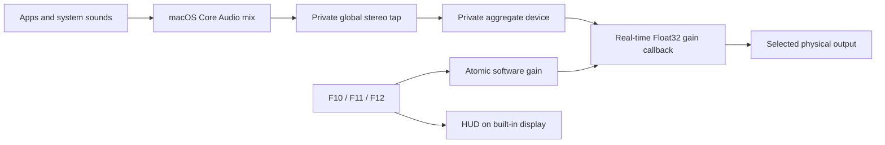

# VoluMAC

VoluMAC is a lightweight native menu-bar utility that routes macOS audio to a selected external display or physical audio output and provides software volume control when that device exposes no writable Core Audio volume control.

It supports wired HDMI, DisplayPort, Thunderbolt, and USB display audio on Apple-silicon Macs. Other non-virtual physical outputs may also appear in the selector when Core Audio reports them as compatible.

> [!IMPORTANT]
> VoluMAC lists compatible connected outputs and remembers the selected device by Core Audio UID, with a device-name fallback for displays whose UID changes after reconnecting or changing ports. Bluetooth, AirPlay, virtual, aggregate, and built-in devices are intentionally excluded from the external-output selector.

## Features

- Lists compatible connected external outputs and lets the user choose one.
- Selects the chosen output for both application audio and system sounds.
- Remembers the selection across reconnects and UID changes.
- Optionally keeps the selected output at 48 kHz when supported.
- Provides software volume attenuation from 0–100% without a virtual HAL driver.
- Handles global media keys:
  - **F10** — mute/unmute
  - **F11** — volume down
  - **F12** — volume up
  - **Option + Shift + F11/F12** — fine adjustment
- Shows a macOS-style volume HUD on the built-in MacBook display.
- Starts automatically at login through a user LaunchAgent.
- Rebuilds its processing engine if Core Audio restarts or the callback stalls.
- Offers an immediate MacBook-speaker fallback from the menu.
- Does not require eqMac, Background Music, BetterDisplay, a privileged helper, or a third-party audio driver.

## How it works



The app keeps the selected physical device as the visible default output. A private `CATapDescription` captures the outgoing PCM mix and uses `.mutedWhenTapped`, so the original unscaled signal is muted only while the app is actively reading the tap. The selected device and tap share a private aggregate-device clock, and a small Objective-C++ real-time callback applies gain directly to the output buffers.

The callback does not allocate memory, log, acquire locks, or invoke UI code. Swift/AppKit owns the menu and control state; the real-time gain is stored atomically.

### Why software volume?

Many HDMI and DisplayPort audio devices expose playback but no writable Core Audio volume or mute property. Software attenuation is therefore applied before samples reach the selected output.

Software volume can only attenuate. Set the monitor’s physical OSD volume to a comfortable upper limit; VoluMAC cannot amplify beyond that hardware level.

## Requirements      

- macOS 14.2 or newer (Core Audio process taps)
- Apple-silicon Mac (`arm64` build target)
- A stereo PCM output capable of 48 kHz
- Tested on:
  - M1 MacBook Air
  - macOS 26.4
  - HDMI monitor with integrated speakers
  - 2-channel HDMI audio at 48 kHz

The prebuilt installer does **not** require Xcode, Command Line Tools, Homebrew, or any other development software.

## Install the prebuilt package

1. Download `VoluMAC-3.0.0.pkg` and `VoluMAC-3.0.0.pkg.sha256` from the [latest GitHub release](https://github.com/utsabfdahal/VoluMAC/releases/latest).
2. Optionally verify the download from the containing directory:

  ```sh
  shasum -a 256 -c VoluMAC-3.0.0.pkg.sha256
  ```

3. Open the package and complete the standard macOS Installer flow. It installs VoluMAC in `/Applications` and starts it automatically at login.
4. Grant **Screen & System Audio Recording** and **Input Monitoring** when macOS requests them.

> [!WARNING]
> This initial package is reproducibly built from the public source but is not yet Developer ID signed or Apple-notarized because no Developer ID Application/Installer certificates are available. macOS may show an unidentified-developer warning. Verify the published SHA-256 checksum, then use **System Settings → Privacy & Security → Open Anyway** if you trust the source and release artifact. A frictionless double-click install requires an Apple Developer Program Developer ID certificate and notarization.

## Build from source

Only contributors rebuilding the app or installer need Xcode Command Line Tools with Swift and Clang:

```sh
xcode-select --install
```

From the repository root:

```sh
./DellAudioMenu/build.sh
```

The ad-hoc-signed app is produced at:

```text
DellAudioMenu/build/VoluMAC.app
```

Run the build directly for development:

```sh
open "DellAudioMenu/build/VoluMAC.app"
```

### Install a source build for the current user

The supplied LaunchAgent is a template containing `__HOME__`. The following installation commands substitute the current user’s home directory:

```sh
mkdir -p "$HOME/Applications"
mkdir -p "$HOME/Library/LaunchAgents"
launchctl bootout "gui/$(id -u)/local.dellaudio.menu" 2>/dev/null || true
rm -f "$HOME/Library/LaunchAgents/local.dellaudio.menu.plist"
rm -rf "$HOME/Applications/Dell Audio.app"
rm -rf "$HOME/Applications/VoluMAC.app"
ditto "DellAudioMenu/build/VoluMAC.app" "$HOME/Applications/VoluMAC.app"
sed "s#__HOME__#$HOME#g" "DellAudioMenu/io.github.utsabfdahal.volumac.plist" > "$HOME/Library/LaunchAgents/io.github.utsabfdahal.volumac.plist"
plutil -lint "$HOME/Library/LaunchAgents/io.github.utsabfdahal.volumac.plist"
launchctl bootout "gui/$(id -u)/io.github.utsabfdahal.volumac" 2>/dev/null || true
launchctl bootstrap "gui/$(id -u)" "$HOME/Library/LaunchAgents/io.github.utsabfdahal.volumac.plist"
launchctl kickstart -k "gui/$(id -u)/io.github.utsabfdahal.volumac"
```

Manual launch:

```sh
open "$HOME/Applications/VoluMAC.app"
```

### Build the installer package

```sh
./DellAudioMenu/package.sh
```

Artifacts are written to `DellAudioMenu/dist/` and are ignored by Git.

## Permissions

VoluMAC requests two macOS privacy permissions. Processing remains local on the Mac.

### Screen & System Audio Recording

Required by the public Core Audio tap API. The app does not save, upload, or transmit captured audio; it only scales samples and immediately writes them to the selected output.

Enable VoluMAC in:

**System Settings → Privacy & Security → Screen & System Audio Recording**

### Input Monitoring

Required for global F10/F11/F12 handling. The event tap is listen-only and processes only mute/volume media events and the F10–F12 fallback keycodes.

Enable VoluMAC in:

**System Settings → Privacy & Security → Input Monitoring**

Because local builds are ad-hoc signed, replacing the executable changes its code hash. If media keys stop working after rebuilding, reset only this app’s Input Monitoring decision, restart it, and grant access again:

```sh
tccutil reset ListenEvent io.github.utsabfdahal.volumac
```

## Usage

1. Connect and power on the external display or output.
2. Start VoluMAC or log in with the LaunchAgent installed.
3. Click the speaker/display icon in the menu bar.
4. Choose an output from the selector.
5. Select **Use Selected Output for All Audio** if it is not already active.
6. Use the slider, mute button, or F10/F11/F12.

Normal volume steps are `1/16` (6.25%). Option+Shift uses `1/64` (1.5625%) steps.

The HUD is deliberately placed on the active built-in MacBook display using `CGDisplayIsBuiltin`, even when an external display is the main screen. If no built-in display is active (for example, clamshell mode), it falls back to the current main screen.

## Tests

Stop the login instance before running executable tests so only one tap owns the output:

```sh
launchctl bootout "gui/$(id -u)/io.github.utsabfdahal.volumac" 2>/dev/null || true
pkill -x VoluMAC 2>/dev/null || true
```

Set a test app variable:

```sh
APP="$PWD/DellAudioMenu/build/VoluMAC.app"
```

Test media-key decoding without requesting Input Monitoring:

```sh
"$APP/Contents/MacOS/VoluMAC" --test-media-key-decode
```

List detected compatible outputs and the remembered selection:

```sh
"$APP/Contents/MacOS/VoluMAC" --test-output-discovery
```

Measure real audio attenuation. This plays a short built-in sound and compares input/output peaks:

```sh
"$APP/Contents/MacOS/VoluMAC" --self-test-gain=0.25
```

Expected measured gain is approximately `0.250`.

Test the built-in-speaker fallback. This intentionally leaves both output selectors on the MacBook speakers:

```sh
"$APP/Contents/MacOS/VoluMAC" --test-built-in-route
```

Show the HUD on the built-in display for three seconds:

```sh
"$APP/Contents/MacOS/VoluMAC" --test-hud
```

Validate the package:

```sh
codesign --verify --deep --strict --verbose=2 "$APP"
plutil -lint "$APP/Contents/Info.plist"
```

## Troubleshooting

### YouTube volume does not change

- Confirm VoluMAC says **software volume active**.
- Confirm the selected device is both the default output and default system output.
- Confirm Screen & System Audio Recording access is enabled.
- Quit any duplicate VoluMAC processes; only one instance should run.
- Restart the LaunchAgent.

```sh
pgrep -fl VoluMAC
launchctl kickstart -k "gui/$(id -u)/io.github.utsabfdahal.volumac"
```

### F10/F11/F12 do not work

- Confirm Input Monitoring access is enabled.
- If the app was rebuilt, reset the stale ad-hoc-signature permission and grant it again.
- The menu displays whether media keys are enabled.

```sh
tccutil reset ListenEvent io.github.utsabfdahal.volumac
open "x-apple.systempreferences:com.apple.preference.security?Privacy_ListenEvent"
```

### One key press changes two steps

Version 3.0 and newer deduplicates the paired system-defined and raw F-key events emitted by Apple keyboards. Ensure only one VoluMAC process is running and that the installed app is current.

### The HUD appears on the wrong display

The app prefers the built-in display. In clamshell mode, macOS reports no active built-in screen, so the HUD uses the main external screen instead.

### A display remains visible but produces no audio

If `afplay` fails with `AudioQueueStart failed ('stop')` and Core Audio logs say it could not establish a timeline after 10 seconds, the Apple-silicon DCP HDMI audio clock is wedged. Restarting `coreaudiod`, changing sample rate, cable replugging, monitor power cycling, and display mode changes may not clear that state. A Mac reboot is the confirmed recovery for this hardware/OS combination.

VoluMAC cannot repair a kernel/DCP clock hang, though keeping one 48 kHz path and removing virtual HAL drivers reduces audio-stack churn.

### An output is not listed

VoluMAC lists non-virtual, non-Bluetooth physical outputs reported by Core Audio, including HDMI, DisplayPort, Thunderbolt, and USB. AirPlay is excluded because it cannot reliably share the private aggregate-device clock. Use `--test-output-discovery` to inspect candidates. Do not hard-code a Core Audio device UID; VoluMAC remembers both UID and name because display UIDs can change across EDID or port states.

## Safety and privacy

- No network access
- No analytics or telemetry
- No audio recording to disk
- No virtual audio driver
- No privileged helper
- No system-file modification
- Private aggregate/tap objects are destroyed on normal shutdown
- Menu **Quit** routes audio to MacBook speakers before terminating

The tap is fail-open: if the processing reader disappears unexpectedly, Core Audio resumes direct unattenuated playback. Keep the monitor’s physical OSD volume at a safe maximum.

## Known limitations

- Bluetooth and AirPlay outputs are excluded from the external-output selector.
- Not every physical audio driver supports private aggregate devices.
- The build script emits arm64 binaries only.
- PCM stereo is supported; encoded HDMI passthrough is not processed.
- DRM/protected-audio behavior has not been fully validated.
- The utility does not fix macOS/DCP firmware hangs.
- Ad-hoc builds may require privacy permissions to be granted again after every binary change.

## Project layout

```text
DellAudioMenu/
├── Info.plist
├── build.sh
├── io.github.utsabfdahal.volumac.plist
├── package.sh
├── Packaging/
│   ├── components.plist
│   ├── io.github.utsabfdahal.volumac.plist
│   └── scripts/
│       ├── preinstall
│       └── postinstall
└── Sources/
    ├── VoluMACApp.swift
    ├── VoluMAC-Bridging-Header.h
    ├── MediaKeyMonitor.swift
    ├── SoftwareVolumeController.swift
    ├── SoftwareVolumeEngine.h
    ├── SoftwareVolumeEngine.mm
    └── VolumeHUDController.swift
```

Additional root-level Swift files are diagnostic utilities used while investigating HDMI clock issues. `report.txt` and `.env` are deliberately ignored because they may contain machine identifiers or secrets.

## Uninstall

For an installation made by the `.pkg` release:

```sh
launchctl bootout "gui/$(id -u)/io.github.utsabfdahal.volumac" 2>/dev/null || true
sudo rm -f "/Library/LaunchAgents/io.github.utsabfdahal.volumac.plist"
sudo rm -rf "/Applications/VoluMAC.app"
sudo pkgutil --forget io.github.utsabfdahal.volumac.installer
defaults delete io.github.utsabfdahal.volumac 2>/dev/null || true
tccutil reset ListenEvent io.github.utsabfdahal.volumac
```

For a source build installed in the current user’s home directory:

```sh
launchctl bootout "gui/$(id -u)/io.github.utsabfdahal.volumac" 2>/dev/null || true
rm -f "$HOME/Library/LaunchAgents/io.github.utsabfdahal.volumac.plist"
rm -rf "$HOME/Applications/VoluMAC.app"
defaults delete io.github.utsabfdahal.volumac 2>/dev/null || true
tccutil reset ListenEvent io.github.utsabfdahal.volumac
```

Remove VoluMAC manually from Screen & System Audio Recording if macOS retains the entry.

## License

VoluMAC is available under the [MIT License](LICENSE).
