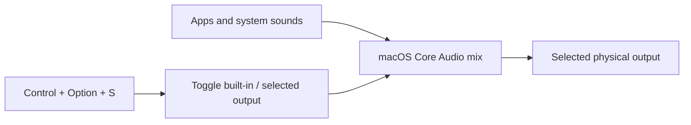

# VoluMAC

VoluMAC is a lightweight native menu-bar utility that switches macOS audio between built-in speakers and a selected external display or physical output.

> [!CAUTION]
> **Version 3.2.1 runs in direct-output safe mode.** Software attenuation is disabled during normal launches because sustained Core Audio process-tap overloads were observed on macOS 26.4, causing garbled display audio and route-change hangs. Output selection and **Control + Option + S** remain available and use no tap, aggregate device, or real-time processing callback.

It supports wired HDMI, DisplayPort, Thunderbolt, and USB display audio on Apple-silicon Macs. Other non-virtual physical outputs may also appear in the selector when Core Audio reports them as compatible.

> [!IMPORTANT]
> VoluMAC lists compatible connected outputs and remembers the selected device by Core Audio UID, with a device-name fallback for displays whose UID changes after reconnecting or changing ports. Bluetooth, AirPlay, virtual, aggregate, and built-in devices are intentionally excluded from the external-output selector.

## Features

- Lists compatible connected external outputs and lets the user choose one.
- Selects the chosen output for both application audio and system sounds.
- Remembers the selection across reconnects and UID changes.
- Uses a direct Core Audio route in normal operation; no process tap or private aggregate remains active.
- Leaves F10/F11/F12 to macOS in direct-output safe mode. HDMI outputs without native volume controls may show the standard unavailable-volume indicator.
- Toggles between Mac speakers and the selected external output with **Control + Option + S** (`⌃⌥S`).
- Uses a compact macOS Sound-style popover with direct output selection, Sound Settings, and advanced options under a bottom ellipsis menu.
- Starts automatically at login through a user LaunchAgent.
- Offers an immediate MacBook-speaker fallback from the menu.
- Does not require eqMac, Background Music, BetterDisplay, a privileged helper, or a third-party audio driver.

## How it works



In 3.2.1 normal operation, the app keeps the selected physical device as the visible default output and does not create a process tap, aggregate device, or audio callback. The software-volume engine remains in the source tree for controlled diagnostics but is not started by the installed app.

Many HDMI and DisplayPort devices expose no writable macOS volume control. In safe mode, use the player volume and monitor’s physical volume control rather than intercepting system audio.

## Requirements      

- macOS 14.2 or newer
- Apple-silicon Mac (`arm64` build target)
- A stereo PCM output capable of 48 kHz
- Tested on:
  - M1 MacBook Air
  - macOS 26.4
  - HDMI monitor with integrated speakers
  - 2-channel HDMI audio at 48 kHz

The prebuilt installer does **not** require Xcode, Command Line Tools, Homebrew, or any other development software.

## Install the prebuilt package

1. Download `VoluMAC-3.2.1.pkg` and `VoluMAC-3.2.1.pkg.sha256` from the [latest GitHub release](https://github.com/utsabfdahal/VoluMAC/releases/latest).
2. Optionally verify the download from the containing directory:

  ```sh
  shasum -a 256 -c VoluMAC-3.2.1.pkg.sha256
  ```

3. Open the package and complete the standard macOS Installer flow. It installs VoluMAC in `/Applications` and starts it automatically at login.
4. No audio-capture or Input Monitoring permission is needed for direct-output safe mode or the **Control + Option + S** shortcut.

> [!WARNING]
> This initial package is reproducibly built from the public source but is not yet Developer ID signed or Apple-notarized because no Developer ID Application/Installer certificates are available. macOS may show an unidentified-developer warning. Verify the published SHA-256 checksum, then use **System Settings → Privacy & Security → Open Anyway** if you trust the source and release artifact. A frictionless double-click install requires an Apple Developer Program Developer ID certificate and notarization.

## Build from source

Only contributors rebuilding the app or installer need Xcode Command Line Tools with Swift and Clang:

```sh
xcode-select --install
```

From the repository root:

```sh
./DellAudioMenu/build.sh
```

The ad-hoc-signed app is produced at:

```text
DellAudioMenu/build/VoluMAC.app
```

Run the build directly for development:

```sh
open "DellAudioMenu/build/VoluMAC.app"
```

### Install a source build for the current user

The supplied LaunchAgent is a template containing `__HOME__`. The following installation commands substitute the current user’s home directory:

```sh
mkdir -p "$HOME/Applications"
mkdir -p "$HOME/Library/LaunchAgents"
launchctl bootout "gui/$(id -u)/local.dellaudio.menu" 2>/dev/null || true
rm -f "$HOME/Library/LaunchAgents/local.dellaudio.menu.plist"
rm -rf "$HOME/Applications/Dell Audio.app"
rm -rf "$HOME/Applications/VoluMAC.app"
ditto "DellAudioMenu/build/VoluMAC.app" "$HOME/Applications/VoluMAC.app"
sed "s#__HOME__#$HOME#g" "DellAudioMenu/io.github.utsabfdahal.volumac.plist" > "$HOME/Library/LaunchAgents/io.github.utsabfdahal.volumac.plist"
plutil -lint "$HOME/Library/LaunchAgents/io.github.utsabfdahal.volumac.plist"
launchctl bootout "gui/$(id -u)/io.github.utsabfdahal.volumac" 2>/dev/null || true
launchctl bootstrap "gui/$(id -u)" "$HOME/Library/LaunchAgents/io.github.utsabfdahal.volumac.plist"
launchctl kickstart -k "gui/$(id -u)/io.github.utsabfdahal.volumac"
```

Manual launch:

```sh
open "$HOME/Applications/VoluMAC.app"
```

### Build the installer package

```sh
./DellAudioMenu/package.sh
```

Artifacts are written to `DellAudioMenu/dist/` and are ignored by Git.

## Permissions

Direct-output safe mode and **Control + Option + S** require neither Screen & System Audio Recording nor Input Monitoring. Audio is not captured or processed.

## Usage

1. Connect and power on the external display or output.
2. Start VoluMAC or log in with the LaunchAgent installed.
3. Click the speaker/display icon in the menu bar.
4. Choose an output directly from the **Output** list.
5. In direct-output safe mode, use the monitor’s physical volume control; the software slider is intentionally disabled.
6. Press **Control + Option + S** or click the bottom arrow button to toggle between Mac speakers and the selected external output.
7. Open status, refresh, and Quit from the bottom ellipsis menu.

## Tests

Stop the login instance before running executable tests so only one app owns the global shortcut:

```sh
launchctl bootout "gui/$(id -u)/io.github.utsabfdahal.volumac" 2>/dev/null || true
pkill -x VoluMAC 2>/dev/null || true
```

Set a test app variable:

```sh
APP="$PWD/DellAudioMenu/build/VoluMAC.app"
```

Verify that the global **Control + Option + S** shortcut can be registered:

```sh
"$APP/Contents/MacOS/VoluMAC" --test-output-shortcut
```

List detected compatible outputs and the remembered selection:

```sh
"$APP/Contents/MacOS/VoluMAC" --test-output-discovery
```

Do not run the legacy software-volume self-tests on macOS 26.4; they intentionally create the process-tap engine that safe mode disables.

Validate the package:

```sh
codesign --verify --deep --strict --verbose=2 "$APP"
plutil -lint "$APP/Contents/Info.plist"
```

## Troubleshooting

### YouTube volume does not change

- Version 3.2.1 intentionally disables software attenuation in normal operation to prevent deadline overloads and garbled display audio.
- Use YouTube’s player volume and the monitor’s physical volume control.
- Confirm the selected device is both the default output and default system output.

```sh
pgrep -fl VoluMAC
launchctl kickstart -k "gui/$(id -u)/io.github.utsabfdahal.volumac"
```

### F10/F11/F12 do not work

- VoluMAC does not intercept these keys in 3.2.1 safe mode.
- macOS may display its unavailable-volume indicator for HDMI outputs without native volume controls.
- Use the player’s volume and the monitor’s physical controls.

### Control + Option + S does not switch outputs

- Confirm the ellipsis menu says **⌃⌥S output toggle enabled**.
- Quit any other utility using the same shortcut, then restart VoluMAC.
- Confirm both Mac speakers and the selected external output appear in VoluMAC.

### Dell audio is distorted after switching back

- Direct-output safe mode must show zero process taps. Switch to Mac speakers immediately if distortion starts.
- A non-consecutive DCP audio clock can remain distorted after quitting VoluMAC, restarting `coreaudiod`, changing sample rate/format, and reconnecting the display path. Restart macOS to reset that endpoint.
- Version 3.2.1 rate-limits all shortcut and UI route changes to avoid repeated transitions that trigger this state.

### A display remains visible but produces no audio

If `afplay` fails with `AudioQueueStart failed ('stop')` and Core Audio logs say it could not establish a timeline after 10 seconds, the Apple-silicon DCP HDMI audio clock is wedged. Restarting `coreaudiod`, changing sample rate, cable replugging, monitor power cycling, and display mode changes may not clear that state. A Mac reboot is the confirmed recovery for this hardware/OS combination.

VoluMAC cannot repair a kernel/DCP clock hang. Version 3.2.1 avoids taps, sample-rate writes, and automatic route changes to minimize audio-stack churn.

### An output is not listed

VoluMAC lists non-virtual, non-Bluetooth physical outputs reported by Core Audio, including HDMI, DisplayPort, Thunderbolt, and USB. Bluetooth and AirPlay are intentionally excluded. Use `--test-output-discovery` to inspect candidates. Do not hard-code a Core Audio device UID; VoluMAC remembers both UID and name because display UIDs can change across EDID or port states.

## Safety and privacy

- No network access
- No analytics or telemetry
- No audio recording to disk
- No virtual audio driver
- No process tap, aggregate device, or audio callback during normal operation
- No privileged helper
- No system-file modification
- Route changes run off the UI thread and are rate-limited

## Known limitations

- Software volume and the custom F10/F11/F12 HUD are disabled in normal 3.2.1 operation while the process-tap stability issue is investigated.
- Bluetooth and AirPlay outputs are excluded from the external-output selector.
- The build script emits arm64 binaries only.
- The utility does not fix macOS/DCP firmware hangs.

## Project layout

```text
DellAudioMenu/
├── Info.plist
├── build.sh
├── io.github.utsabfdahal.volumac.plist
├── package.sh
├── Packaging/
│   ├── components.plist
│   ├── io.github.utsabfdahal.volumac.plist
│   └── scripts/
│       ├── preinstall
│       └── postinstall
└── Sources/
    ├── VoluMACApp.swift
    ├── VoluMAC-Bridging-Header.h
    ├── MediaKeyMonitor.swift
    ├── OutputShortcutMonitor.swift
    ├── SoftwareVolumeController.swift
    ├── SoftwareVolumeEngine.h
    ├── SoftwareVolumeEngine.mm
    └── VolumeHUDController.swift
```

Additional root-level Swift files are diagnostic utilities used while investigating HDMI clock issues. `report.txt` and `.env` are deliberately ignored because they may contain machine identifiers or secrets.

## Uninstall

For an installation made by the `.pkg` release:

```sh
launchctl bootout "gui/$(id -u)/io.github.utsabfdahal.volumac" 2>/dev/null || true
sudo rm -f "/Library/LaunchAgents/io.github.utsabfdahal.volumac.plist"
sudo rm -rf "/Applications/VoluMAC.app"
sudo pkgutil --forget io.github.utsabfdahal.volumac.installer
defaults delete io.github.utsabfdahal.volumac 2>/dev/null || true
tccutil reset ListenEvent io.github.utsabfdahal.volumac
```

For a source build installed in the current user’s home directory:

```sh
launchctl bootout "gui/$(id -u)/io.github.utsabfdahal.volumac" 2>/dev/null || true
rm -f "$HOME/Library/LaunchAgents/io.github.utsabfdahal.volumac.plist"
rm -rf "$HOME/Applications/VoluMAC.app"
defaults delete io.github.utsabfdahal.volumac 2>/dev/null || true
tccutil reset ListenEvent io.github.utsabfdahal.volumac
```

Older releases may remain listed under Screen & System Audio Recording or Input Monitoring. Version 3.2.1 safe mode does not use either permission.

## License

VoluMAC is available under the [MIT License](LICENSE).
